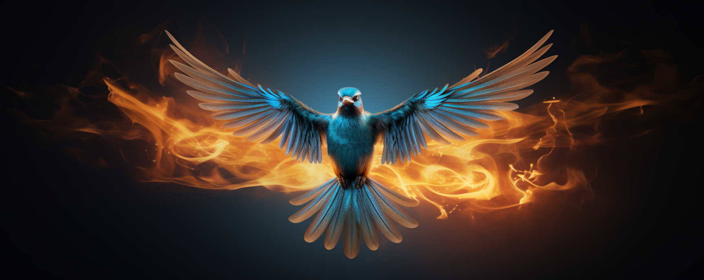

# NoDogeTweeter

NoDogeTweeter is a Chrome extension that reverts the 𝕏 logo back to the original Twitter logo and changes the favicon back to its original design. This extension is useful if you prefer the original Twitter aesthetics over the changes made by Elon Musk.

## Features

- Automatically detects the 𝕏 logo on Twitter and replaces it with the original Twitter logo.
- Reverts the favicon back to its original design.
- Preserves the original HTML structure.

## Installation

1. Clone this repository:

​	`git clone https://github.com/yourusername/NoDogeTweeter.git`

2. Open Google Chrome, go to `chrome://extensions/`.
3. Enable "Developer Mode" by toggling the switch in the top-right corner.
4. Click the "Load unpacked" button and navigate to the cloned repository's folder, then select it.

The NoDogeTweeter extension should now be installed and active in your Chrome browser.

## Usage

After installing the extension, simply visit Twitter, and the logo should be automatically reverted to the original one.

## License

This project is licensed under the MIT License. See the [LICENSE](LICENSE) file for more information.

## Acknowledgements

GPT-4 (ChatGPT & Poe)
